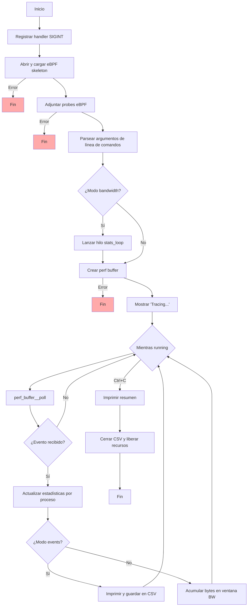

```mermaid
flowchart TD
    A[Inicio] --> B[Registrar handler SIGINT]
    B --> C[Abrir y cargar eBPF skeleton]
    C -->|Error| Z1[Fin]
    C --> D[Adjuntar probes eBPF]
    D -->|Error| Z2[Fin]
    D --> E[Parsear argumentos de línea de comandos]
    E --> F{¿Modo bandwidth?}
    F -- Sí --> G[Lanzar hilo stats_loop]
    G --> H[Crear perf buffer]
    F -- No --> H
    H -->|Error| Z3[Fin]
    H --> I[Mostrar 'Tracing...']
    I --> J{Mientras running}
    J --> K[perf_buffer__poll]
    K --> L{¿Evento recibido?}
    L -- Sí --> M[Actualizar estadísticas por proceso]
    M --> N{¿Modo events?}
    N -- Sí --> O[Imprimir y guardar en CSV]
    N -- No --> P[Acumular bytes en ventana BW]
    L -- No --> J
    O --> J
    P --> J
    J -- Ctrl+C --> Q[Imprimir resumen]
    Q --> R[Cerrar CSV y liberar recursos]
    R --> S[Fin]

    %% Errores
    style Z1 fill:#faa
    style Z2 fill:#faa
    style Z3 fill:#faa
```
