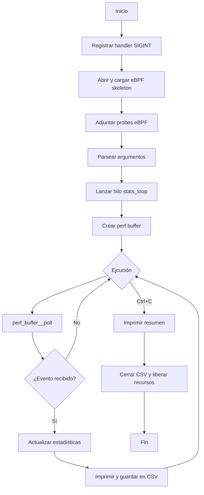

```mermaid
flowchart TD
    A[Inicio] --> B[Registrar handler SIGINT]
    B --> C[Abrir y cargar eBPF skeleton]
    C --> D[Adjuntar probes eBPF]
    D --> E[Parsear argumentos ]
    E -->  G[Lanzar hilo stats_loop]
    G --> H[Crear perf buffer]
    H -->  J{Ejcución}
    J --> K[perf_buffer__poll]
    K --> L{¿Evento recibido?}
    L -- Sí --> M[Actualizar estadísticas]
    M -->  O[Imprimir y guardar en CSV]
    L -- No --> J
    O --> J
    J -- Ctrl+C --> Q[Imprimir resumen]
    Q --> R[Cerrar CSV y liberar recursos]
    R --> S[Fin]
```
