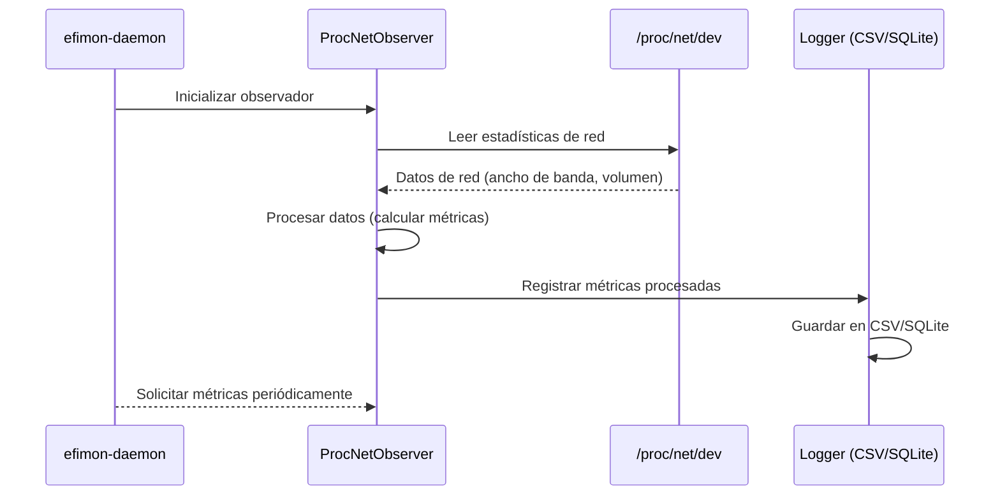

```mermaid
sequenceDiagram
    participant Daemon as efimon-daemon
    participant NetObserver as ProcNetObserver
    participant ProcFile as /proc/net/dev
    participant Logger as Logger (CSV/SQLite)

    Daemon->>NetObserver: Inicializar observador
    NetObserver->>ProcFile: Leer estadísticas de red
    ProcFile-->>NetObserver: Datos de red (ancho de banda, volumen)
    NetObserver->>NetObserver: Procesar datos (calcular métricas)
    NetObserver->>Logger: Registrar métricas procesadas
    Logger->>Logger: Guardar en CSV/SQLite
    Daemon-->>NetObserver: Solicitar métricas periódicamente
```
